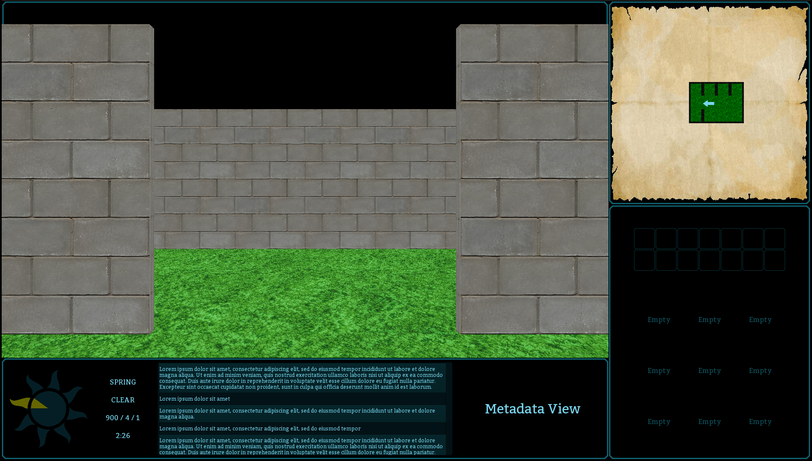
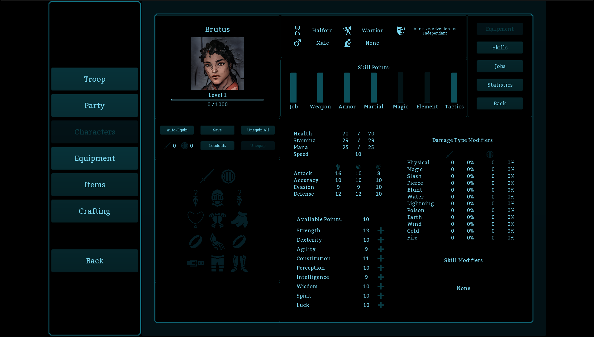

# Preamble

This project is part of a series to use AI tools under various different conditions.

* Standard scenario:
    * [FFXI Single Player](https://github.com/NatePillow/LandSandBoat/blob/singleplayer/DIARY.md)
    * Domain knowledge, planning, and core development was completed by the human dev, an AI tool was then "onboarded" onto the project while it was being prepped for long-term feature development, and then said feature development is turned over to the AI tool indefinitely.
* Full scenario:
    * [fowl-jungle-editor](https://github.com/NatePillow/fowl-jungle-editor)
    * Zero human code, only human guidance and correction.
* Legacy scenario:
    * **This project**
    * A well-established codebase with particular quirks that give AI tools a hard time. This has forced a decision to refactor code to try to better equip AI tools for success.

---

# Fowl Jungle

---

## Refactor

While the content layer and its editor, 3d rendering, and gameplay portions of the app are moving along smoothly, the scene2d capabilities used to render the elaborate menus seem to give AI tools trouble, likely due to:

* A heavier than usual reliance on scene2d, which is likely a secondary feature set from the libgdx library in most scenarios
* Training data scarcity for libgdx, particularly modern examples
* Spatial blindness and an inability to understand how various visual attributes intermingle
* The UI depends heavily on many defining attributes found in skin.json, which represents a barrier to AI tools understanding key attributes of the UI design unless the entire skin definition is fed into context.

Refactoring goals should be to establish a design and appropriate steering documents.

* Design Requirements
  * The AI tools will need to be able to easily determine things like pixel sizes of fills, pads, elements, etc so that it can build a visual map
  * Provide building blocks that the AI tool can know about a priori. Pre-configured elements should have corresponding steering file entries which elaborate on the expected visual impact 
  * skin.json should get a dedicated steering file to control context bloat
* Goals
  * AI tools can do a better job of placing and manipulating elements
  * Improved human readability and reduced code sprawl

---

## Project Description

Fowl Jungle is a first-person, turn-based RPG that seeks to advance retro gaming rather than copy it. Instead of relying on well-worn mechanics and nostalgia as the entire gameplay experience, Fowl Jungle uses retro-inspired gameplay as a foundation to build on and attempts to advance the genre without compromising the soul of early RPGs. Old-timers will appreciate the familiar feeling combined with a variety of new gameplay mechanics and substantial flexibility, while newcomers will find a fresh take on retro RPGs with modern amenities and more engaging gameplay systems.

This project is designed from the ground up to be deeply moddable. 

---

---

